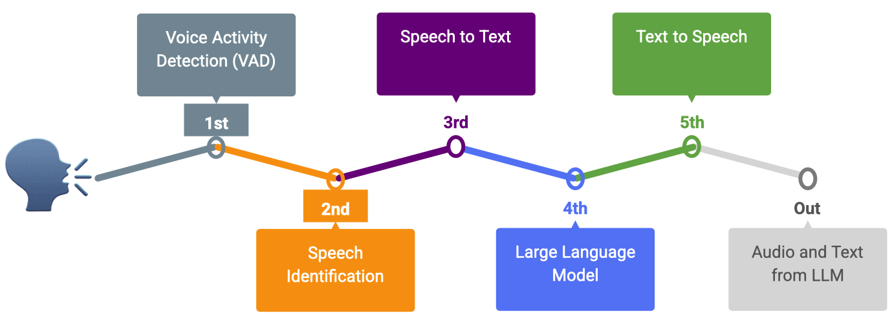

# [MINDSIS]

> What is this? -> It is an AI Assistant created by mindnous.\
> What is MINDSIS? -> It is an abbrev. of **Mindnous AI Assistant**.



---


## Summary
- Realtime AI assistant with Speech-to-text (STT) + LLM + text-to-Speech (TTS) capability.
- Target device: Arm(RK-device, Mac, NVIDIA Jetson) and AMD64 devices.
- Supported Speech-Classify: [3dspeaker-CN-EN-16K-CAM++](https://github.com/k2-fsa/sherpa-onnx/releases/tag/speaker-recongition-models).
- Supported Speech-to-text: [Whisper-base](https://huggingface.co/onnx-community/whisper-base).
- Supported Text-to-speech: any popular TTS on the community. Default: [vits-en-us-ryan-medium](https://huggingface.co/csukuangfj/vits-piper-en_US-ryan-medium).

## How to Use

- Install dependencies
  ```
  # be sure to install cmake, and portaudio beforehands
  pip3 install -r requirements.txt
  ```

- Use Voice Activity Detector (VAD)
  * Go to ```vad``` folder.
  * edit "sf.read" path inside **__main__** function, and fill it with your audio path.
  * Run vad.py, example:
    ```
    python3 vad.py
    ```

- Use Speech Identification
  * Go to ```speechclassify``` folder.
  * edit text inside **__main__** function at the "audio_file" variable and fill it with your audio path.
  * Run scls.py, example:
    ```
    python3 tts.py
    ```

- Use Speech to Text
  * Go to ```speech2text``` folder.
  * Run stt.py with model and audio folder path, example:
    ```
    python3 stt.py --encoder_model_path ../model/encoder_model_fp16.onnx --decoder_model_path ../model/decoder_model_int8.onnx --audio ../examples
    ```

- Use LLM/VLM
  * Go to ```llm``` folder.
  *   
  * Run llm.py with modelname/path and model_info / config that you used, <details><summary>see complete example</summary>

    ```
    print('GENERAL PARAMETER FOR INFERENCE')
    prompt = "please return all 2d coordinate of pedestrian in x1y1x2y2 with json format"
    imagepath = "/Users/brilian/Documents/aiot/mindsis/examples/image1.jpg"
    image = cv2.cvtColor(cv2.imread(imagepath), cv2.COLOR_BGR2RGB)

    print('INITIALIZATION')

    ### MLX 
    print('LLMWrapper[MLX] - LLM')
    # LLM type
    model_path = "/Users/brilian/Documents/aiot/Qwen2.5-14B-Instruct-4bit"
    model_info={'llm_type': 'llm'}
    llmwrap = LLMWrapper(model_path, model_info=model_info, model_type='mlx')
    for _ in range(5):
        response = llmwrap(messages=prompt)
        print(_, '=' * 50, '\nresponse: ', response)

    # VLM type
    print('LLMWrapper[MLX] - VLM')
    model_path = "/Users/brilian/Documents/aiot/Qwen2.5-VL-7B-Instruct-4bit"
    model_info={'llm_type': 'vlm'}
    llmwrap = LLMWrapper(model_path, model_info=model_info, model_type='mlx')
    for _ in range(5):
        response = llmwrap(messages=prompt, image_paths=[image])
        print(_, '=' * 50, '\nresponse: ', response)
    ###

    ### Litellm / openai / ollama server
    print('LLMWrapper[Litellm / openai / ollama server] - LLM')
    # litellm with ollama server
    modelname="ollama/qwen2.5:latest"
    model_info=dict(model_url="http://localhost:11434")
    llmwrap = LLMWrapper(modelname, model_info=model_info, model_type='ollama')
    for _ in range(5):
        response = llmwrap(messages=prompt)
        print(_, '=' * 50, '\nresponse: ', response)
    ###


    ### OLLAMA OFFLINE
    # Ollama offline - LLM type
    print('LLMWrapper[Ollama offline] - LLM')
    # modelname = "deepseek-r1:14b"
    modelname = "qwen2.5:latest"
    llmwrap = LLMWrapper(modelname, model_type='ollama_offline')
    for _ in range(5):
        response = llmwrap(messages=prompt)
        print(_, '=' * 50, '\nresponse: ', response)

    # Ollama offline - VLM type
    print('LLMWrapper[Ollama offline] - VLM')
    # modelname = "minicpm-v:8b-2.6-q4_K_M"
    modelname = "gemma3:12b"
    llmwrap = LLMWrapper(modelname, model_type='ollama_offline')
    for _ in range(5):
        response = llmwrap(messages=prompt, images=[image])
        print(_, '=' * 50, '\nresponse: ', response)
    ###
    ```

    </details>
  

- Use Text to Speech
  * Go to ```text2speech``` folder.
  * edit text inside **__main__** function at the bottom of the tts.py file,  then run bellow
  * Run tts.py, example:
    ```
    python3 tts.py
    ```

## PROGRESS

- [x] Voice Activity Detection (VAD).
- [x] Zero-shot Speech classification/identification.
- [x] Large Language Model.
- [x] Speech to text.
- [x] Text to speech.
- [ ] Integrate all parts together.
- [ ] Add external interactions for productivity purpose.

---

# ACKNOWLEDGEMENT

- [sherpa-onnx](https://k2-fsa.github.io/sherpa/index.html)
- [3d Speaker](https://github.com/modelscope/3D-Speaker.git)
- [PINTO MODEL ZOO](https://k2-fsa.github.io/sherpa/index.html)
- Open-source community and packages.